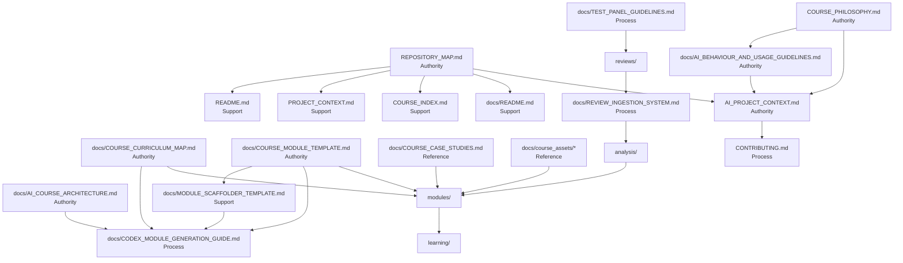

# Documentation Dependency Map

## Purpose

This map defines the recommended documentation architecture after the audit. It identifies which files are authoritative, which files depend on them, and how the documentation supports the repository pipeline:

`reviews -> analysis -> modules -> learning`

## Document Roles

### Authority

- `COURSE_PHILOSOPHY.md`
- `REPOSITORY_MAP.md`
- `AI_PROJECT_CONTEXT.md`
- `docs/AI_BEHAVIOUR_AND_USAGE_GUIDELINES.md`
- `docs/AI_COURSE_ARCHITECTURE.md`
- `docs/AI_COURSE_ROADMAP.md`
- `docs/COURSE_CURRICULUM_MAP.md`
- `docs/COURSE_MODULE_TEMPLATE.md`

### Support

- `README.md`
- `PROJECT_CONTEXT.md`
- `COURSE_INDEX.md`
- `docs/README.md`
- `docs/MODULE_SCAFFOLDER_TEMPLATE.md`
- layer READMEs in `analysis/`, `modules/`, `learning/`, `drafts/`, `archive/`, `prompts/`, `capstones/`, and `reviews/`

### Process

- `CONTRIBUTING.md`
- `docs/CODEX_MODULE_GENERATION_GUIDE.md`
- `docs/REVIEW_INGESTION_SYSTEM.md`
- `docs/TEST_PANEL_GUIDELINES.md`
- `docs/session_notes/README.md`

### Reference

- `docs/COURSE_CASE_STUDIES.md`
- `docs/course_assets/*`

## Source-of-Truth Relationships

### Repository and navigation

- `REPOSITORY_MAP.md` is the source of truth for repository structure and layer boundaries.
- `README.md`, `PROJECT_CONTEXT.md`, `COURSE_INDEX.md`, and `docs/README.md` should summarize or point to `REPOSITORY_MAP.md`, not compete with it.

### Philosophy and AI behavior

- `COURSE_PHILOSOPHY.md` is the source of truth for course principles.
- `docs/AI_BEHAVIOUR_AND_USAGE_GUIDELINES.md` derives from and operationalizes the philosophy at the principle level.
- `AI_PROJECT_CONTEXT.md` derives from both and defines repository-specific AI operating behavior.
- `CONTRIBUTING.md` should defer to those authorities rather than restating them in full.

### Course design and authoring

- `docs/AI_COURSE_ARCHITECTURE.md` is the source of truth for course design architecture.
- `docs/COURSE_CURRICULUM_MAP.md` is the source of truth for module inventory by tier.
- `docs/COURSE_MODULE_TEMPLATE.md` is the source of truth for module shape.
- `docs/MODULE_SCAFFOLDER_TEMPLATE.md` is a compressed derivative of the module template.
- `docs/CODEX_MODULE_GENERATION_GUIDE.md` is a process doc that depends on all three.

### Review and revision pipeline

- `docs/TEST_PANEL_GUIDELINES.md` defines how feedback is collected.
- `reviews/` stores the raw outputs from that process.
- `docs/REVIEW_INGESTION_SYSTEM.md` defines how raw review data is processed into analysis.
- `analysis/` stores issue ledgers, syntheses, revision plans, and shared fixes.
- `modules/` is revised based on those outputs.
- `learning/` is derived from `modules/`.

## Repository Pipeline Support

### `reviews`

- Supported by:
  - `docs/TEST_PANEL_GUIDELINES.md`
  - `reviews/README.md`

### `analysis`

- Supported by:
  - `docs/REVIEW_INGESTION_SYSTEM.md`
  - `analysis/README.md`
  - shared-fix and asset-mapping docs under `analysis/`

### `modules`

- Supported by:
  - `docs/COURSE_CURRICULUM_MAP.md`
  - `docs/COURSE_MODULE_TEMPLATE.md`
  - `docs/MODULE_SCAFFOLDER_TEMPLATE.md`
  - `docs/CODEX_MODULE_GENERATION_GUIDE.md`
  - `docs/COURSE_CASE_STUDIES.md`
  - `docs/course_assets/*`
  - `modules/README.md`

### `learning`

- Supported by:
  - `REPOSITORY_MAP.md`
  - `learning/README.md`
  - the active module source files in `modules/`

## Dependency Rules

1. Support docs should point to authority docs instead of restating them in depth.
2. Process docs should describe execution steps, not redefine philosophy or repository structure.
3. Reference docs should supply reusable material, not become policy documents.
4. Root docs should remain entry points or top-level authorities, not duplicates of deep `docs/` material.
5. `modules/` contains the authoritative instructional content defined by the curriculum map; `learning/` is downstream.

## Mermaid Diagram

## Practical Interpretation

If a document starts competing with the authority listed above, it should be trimmed or rewritten. The system works best when:

- root docs get people oriented quickly
- authority docs remain singular and stable
- process docs explain how to act
- reference docs provide reusable content
- the repo pipeline remains easy to follow from raw feedback to delivered learning experience
